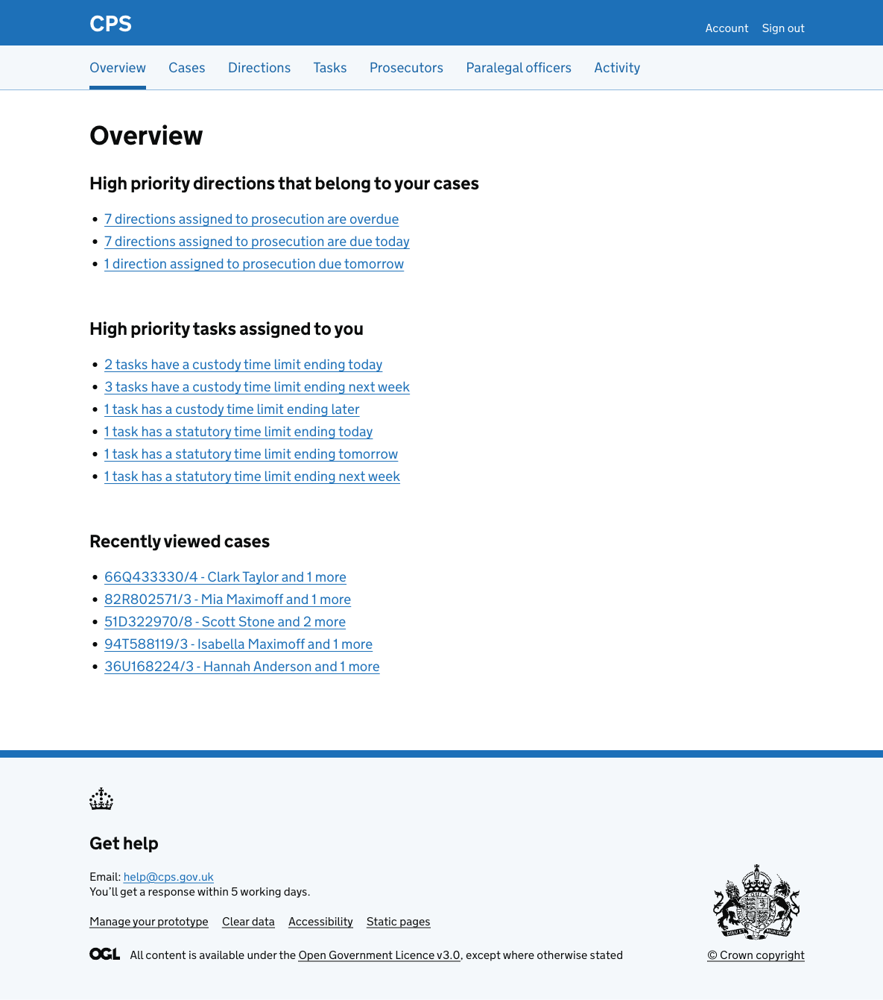
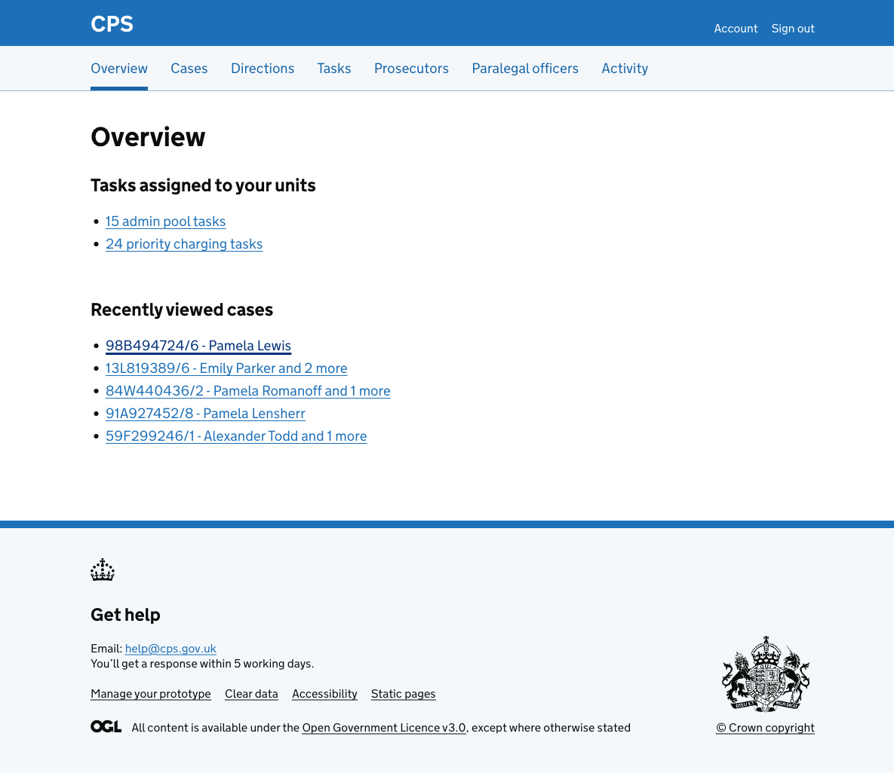

Users work across tasks and directions, and need to know what needs their attention without having to go into each list, apply filters, and work out what's urgent.

The overview page gives users a single place to see their most important work at a glance.

## How it works

Users get to the overview by clicking "Overview" in the main navigation. It's also the first page they see after signing in.

The page shows different information depending on the user's role.

### Paralegal officers

Paralegal officers see two sections:

- **High priority directions that belong to your cases** - links to overdue directions, directions due today, and directions due tomorrow, each filtered to prosecution
- **High priority tasks assigned to you** - links to tasks filtered by urgent status, PACE clock expiry, CTL expiry, and STL expiry

Each item is a link that takes the user directly to the task list or direction list with the relevant filter pre-applied.

### Prosecutors

Prosecutors see the same sections as paralegal officers. The directions shown are filtered to cases where they are the assigned prosecutor.

### Casework assistants

Casework assistants are not assigned tasks individually in the same way. Instead, they work from shared admin pools.

They see a "Tasks assigned to your units" section with links to:

- admin pool tasks across their units
- priority charging tasks across their units

