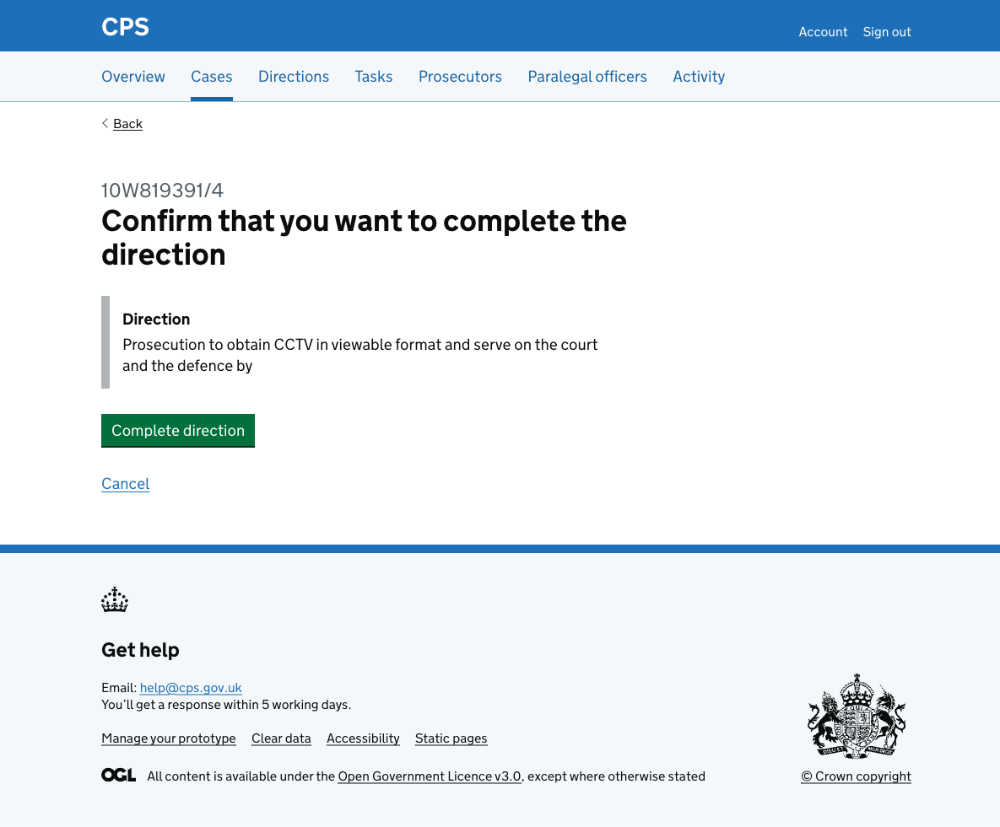
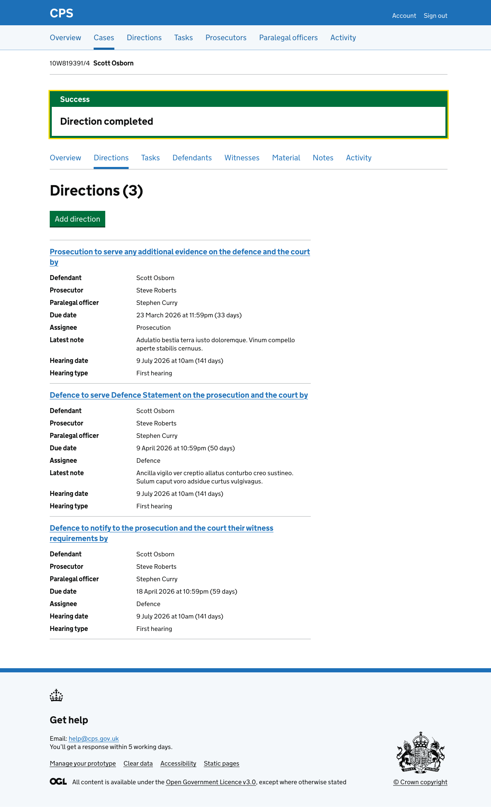
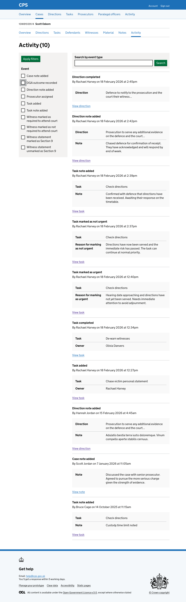

Users need to be able to complete directions. 

Users get to the flow by clicking "Complete direction" on the [direction details page](2026-02-17-adding-a-direction-details-page.md).

## How it works

The confirmation page shows the direction description in an inset and asks users to confirm they want to complete it. A cancel link lets users go back to the direction details page without making any changes.

After confirming, the user is taken back to the [case direction list](2026-02-17-allowing-users-to-see-directions-for-a-specific-case.md) where a success banner confirms "Direction completed". The completed direction no longer appears in the list.

### Activity log

The action is recorded in the case activity log as "Direction completed", showing the direction description and a link to view the direction.

