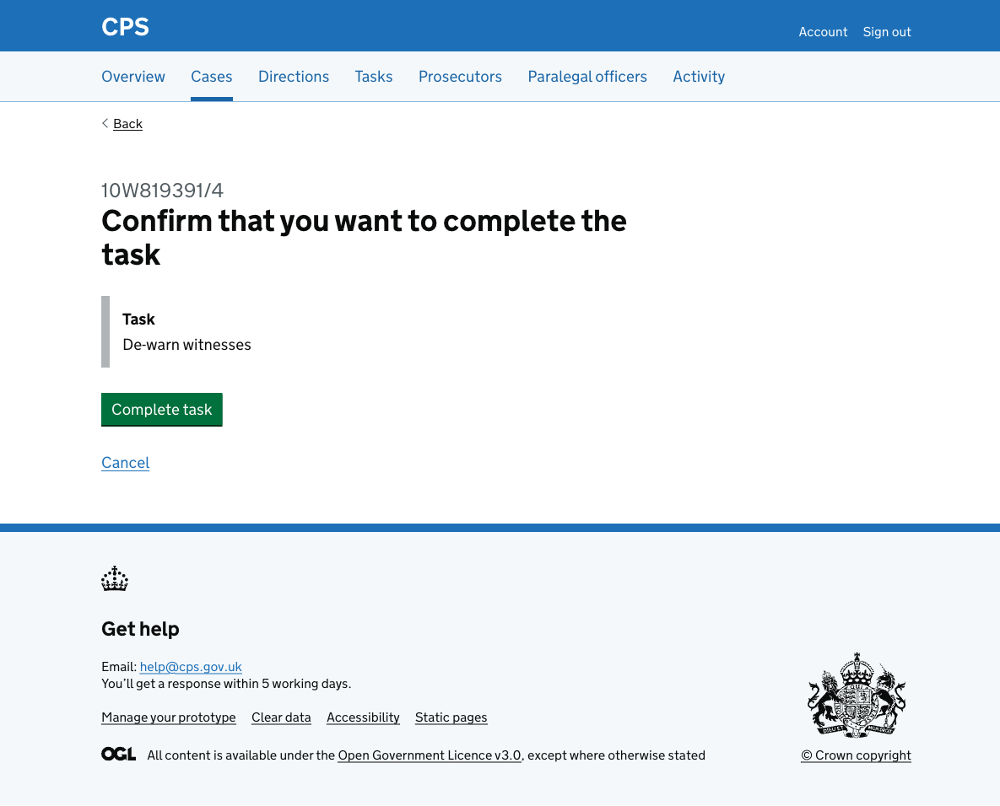

Some tasks, like early advice manager triage and check new PCD case, have dedicated flows that guide users through the work. 

But many tasks require users to do the work separately and then come back to mark them as complete. This flow handles that.

## How it works

Users get to the flow by clicking "Complete task" on the [task details page](2026-02-17-adding-a-task-details-page.md).

The confirmation page shows the task name in an inset and asks users to confirm they want to complete it. A cancel link lets users go back to the task details page without making any changes.

After confirming, the user is taken back to the [case task list](2026-02-17-allowing-users-to-see-tasks-for-a-specific-case.md) where a success banner confirms "Task completed". The completed task no longer appears in the list.

### Activity log

The action is recorded in the case activity log as "Task completed", showing the task name, owner, and a link to view the task.

