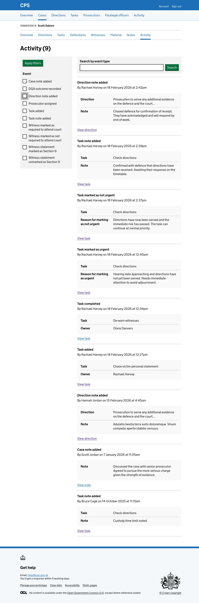

Notes are currently accessed via an icon on the directions list, which opens a modal dialogue - a pattern we wanted to avoid. The modal has several problems:

- it's cramped and requires scrolling because the form is taller than the viewport
- it has two toggle switches - "flag as urgent note" and "flag as urgent task" - that behave confusingly: selecting both disables "flag as urgent note"
- the previous notes section is blank and takes up a lot of space when there are no notes
- the "Add note" button is pinned to the bottom of the modal, away from the form

We redesigned the flow to use dedicated pages instead.

## How it works

Clicking "Add note" on the [direction details page](2026-02-17-adding-a-direction-details-page.md) takes the user to a page to enter a note. An inset shows the direction description so users can confirm they are adding a note to the right direction.

After entering a note, the user is taken to the check answers page:

The direction is shown without a change link. The note has a change link to go back and edit it.

After clicking "Add note", the user is taken back to the direction details page. A success banner confirms "Note added" and the new note appears at the top of the notes list.

### Activity log

The action is recorded in the activity log as "Direction note added", showing the direction description and the note text.

## Error messages

### Note

- No note entered: Enter a note
