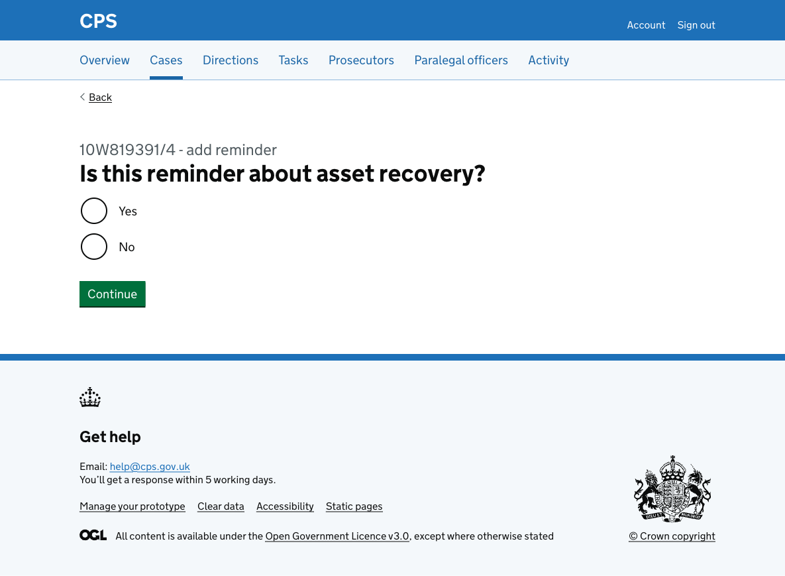
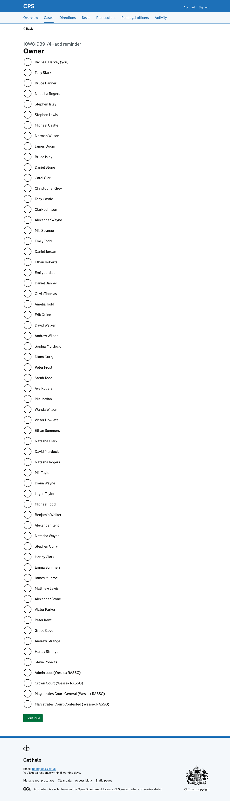

Users sometimes need to create their own reminders to follow up on something related to a case.

## How it works

Users reach the flow by clicking "Add reminder" on the [case task list](2026-02-17-allowing-users-to-see-tasks-for-a-specific-case.md).

The flow begins on a page to enter a description of the reminder, using a character count component with a 5,000 character limit.

After entering a description, the user is asked whether the reminder is about asset recovery. This determines the reminder type stored against the task.

Next, the user is asked to enter three dates: a reminder date for when they should first be reminded, a due date for when the task must be completed, and an escalation date for when the task should escalate if still incomplete.

After entering dates, the user selects who the reminder is assigned to. The list includes all users in the case's unit, with the signed-in user shown first as "(you)". Admin pool and other team options for the unit appear at the bottom of the list.

After selecting an owner, the user is taken to the check answers page:

Each row has a change link to go back and edit that step.

After clicking "Add reminder", the user is taken to the new task's details page. A success banner confirms "Reminder added".

### Activity log

The action is recorded in the activity log as "Task added", showing the task name, owner, and a link to view the task.

