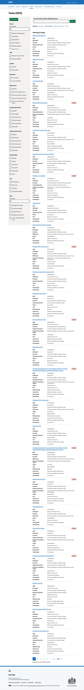
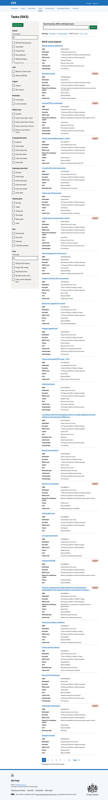

The task list is one of the most important pages in the service. 

It’s where users across roles and units go to process and progress cases in different states. Getting it right has a direct impact on how quickly cases are processed and the operating costs of the service.

The current task list has significant problems:

- it is not responsive, making it hard to use on smaller screens
- dates are not in GOV.UK style, making them hard to read
- icons are used instead of text, probably to save space -the Service Standard recommends against this
- filters are hidden behind dropdowns, which have multiple downsides
- information is buried inside nested accordions, including empty fields that waste space
- the language is confusing -for example "escalated" means "very overdue" but does not say that
- users can only see one unit at a time, even though many work across multiple units
- tabs split the same list into separate views, fragmenting the user’s workflow
- the page heading says "Hi [name]" rather than describing what the user is looking at
- some users have resorted to maintaining their own spreadsheets outside the system because the task list does not support their needs well enough

Many of these issues were flagged in the last service assessment and we committed to improving them.

We redesigned the task list to address these problems.

Users reach the task list by clicking "Tasks" in the main navigation. 

They can also use the links on the overview page to jump directly to high-priority tasks such as critically overdue tasks or tasks with an imminent custody time limit.

## How it works

When users first visit the task list, it is automatically filtered to show only their own tasks. This means they see what they need to act on immediately, without having to set filters manually.

Tasks are grouped by severity so the most urgent work is always at the top:

- Critically overdue
- Overdue
- Due soon
- Not due yet

Each task card shows:

- task name (as a link)
- urgent tag (where applicable)
- URN
- operation name (where applicable)
- defendant
- due date
- custody time limit (where applicable)
- statutory time limit (where applicable)
- PACE clock (where applicable)
- reason for marking as urgent (where applicable)
- owner
- unit
- reminder type (where applicable)
- latest note (where applicable)
- hearing date and type (where applicable)

We only show fields that have values, so cards do not show empty rows.

Dates are shown with a bracketed status to help users judge urgency at a glance. For due date, custody time limit, statutory time limit, and hearing date:

- past dates show "(overdue)"
- a date that falls today shows "(today)"
- a date that falls tomorrow shows "(tomorrow)"
- dates further ahead show the number of days remaining, for example "(4 days)" or "(11 days)"

Due dates can also show "(critically overdue)" for tasks that are significantly past due.

The PACE clock is measured in hours rather than days:

- "(expired)"
- "(ends in less than 1 hour)"
- "(ends in less than 2 hours)"
- "(ends in less than 3 hours)"
- "(ends in more than 3 hours)"

The selected owner filter appears at the top of the filter panel as a tag with a remove link. A "Clear filters" link is available to remove all active filters at once.

When filters are cleared, the full list of tasks across all units is shown. For larger teams this can be hundreds of tasks.

### Filters

The filter panel is visible on the left side of the page, not hidden behind dropdowns. This follows GOV.UK guidance and means users can see and change filters without having to expand a menu.

There are 11 filter groups:

- **Owner** - searchable list of users and teams (admin pools) visible to the signed-in user
- **Unit** - the units the user belongs to
- **Urgent** - filter by urgent or not urgent
- **Reminder** - filter by whether a task is a reminder
- **PACE clock** - filter by time remaining on the PACE clock
- **Custody time limit (CTL)** - filter by when the CTL expires
- **Statutory time limit (STL)** - filter by when the STL expires
- **Hearing date** - filter by when the next hearing is
- **Due** - filter by when it’s due
- **Task** - searchable list of all task types

The owner filter includes both named users and team pools (for example, "Admin pool (North Yorkshire Magistrates Court)"). This means users can filter to work that is assigned to a shared pool, not just an individual.

When filters are applied, the selected values appear as tags at the top of the filter panel with individual remove links. Users click "Apply filters" to submit the form.

### Search

A search bar at the top of the results area lets users search by task name, URN, or defendant name. This is useful when users know exactly what they are looking for and do not need to browse.

### Sort options

By default tasks are sorted by due date and grouped by severity. Users can change the sort to prioritise different types of urgency.

**Hearing date** groups tasks by when the next hearing is. This is useful when preparing for court.

- Overdue
- Today
- Tomorrow
- This week
- Next week
- Later
- No hearing date

**PACE clock** groups tasks by how much time is left on the police and criminal evidence clock. This is critical for tasks involving suspects in custody.

- Expired
- Less than 1 hour
- Less than 2 hours
- Less than 3 hours
- More than 3 hours

**CTL (custody time limit)** groups tasks by when the defendant’s custody time limit expires. This helps users prioritise tasks for defendants held in custody.

- Expired
- Today
- Tomorrow
- This week
- Next week
- Later

**STL (statutory time limit)** groups tasks by when the statutory time limit expires, using the same groupings as CTL. This is relevant for pre-charge cases.

- Expired
- Today
- Tomorrow
- This week
- Next week
- Later

### Casework assistants

Casework assistants do not own tasks in the same way as prosecutors and paralegal officers. They work from shared admin pools rather than being assigned tasks individually.

When a casework assistant visits the task list, the default filter is set to their own name - but because they have no tasks assigned to them personally, they won’t see any tasks without changing the owner filter to an admin pool to see the work relevant to them.

Prosecutors see the same default behaviour as paralegal officers -the list is filtered to their own tasks on first visit.

### Pagination

Results are paginated at 25 tasks per page, following the GOV.UK pagination component. The total number of matching tasks is shown in the page heading, for example "Tasks (593)".

## Future considerations

The current task model has inherent limitations. Tasks are created manually or by the system and assigned to individuals or teams, but there is no structured relationship between a task and the state a case is in. This means the task list shows what people have been asked to do, but not necessarily what needs to happen next in the case.

A more robust model would be to replace tasks with a case state machine, where each case moves through defined states, for example:

- ready for triage
- ready for review
- ready to assign

This would make it clearer what action is needed at each stage and reduce the need for manual task management.

This is a significant structural change that would require rethinking the underlying data model and would go beyond the scope of this iteration.

Tasks currently have three dates - a reminder date, a due date, and an escalation date - and each one triggers a different severity state.

It's worth questioning whether this is clear to users. To understand why a task is in a particular group, users would need to know that tasks have three separate dates and that crossing each one changes the task's status.

A simpler model would be a single due date, with urgency calculated automatically based on how many days remain. Users would only need to understand one concept - when the task is due - rather than a set of thresholds they can't easily see or reason about.
