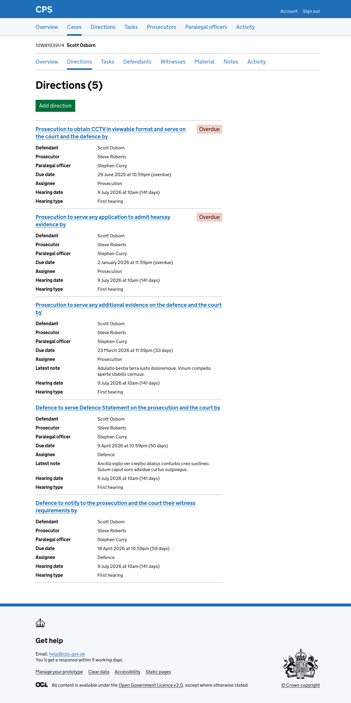

The [direction list](2026-02-18-directions.md) shows all directions across all cases. The case direction list shows all the directions for a single case in one place.

Users reach the case direction list by navigating to a case and clicking "Directions" in the case navigation.

## How it works

The page shows all open directions for the case, sorted by due date. There is no filtering - users can see everything at a glance.

Each direction card shows:

- direction description (as a link)
- status tag (where applicable)
- defendant (where applicable)
- prosecutor
- paralegal officer
- due date (with days remaining or overdue status)
- assignee (Prosecution or Defence)
- latest note (where applicable)
- custody time limit (where applicable)
- hearing date and type (where applicable)

We only show fields that have values, so cards do not show empty rows.

### Adding directions

Users can add a direction to the case using the "Add direction" button at the top of the page.
