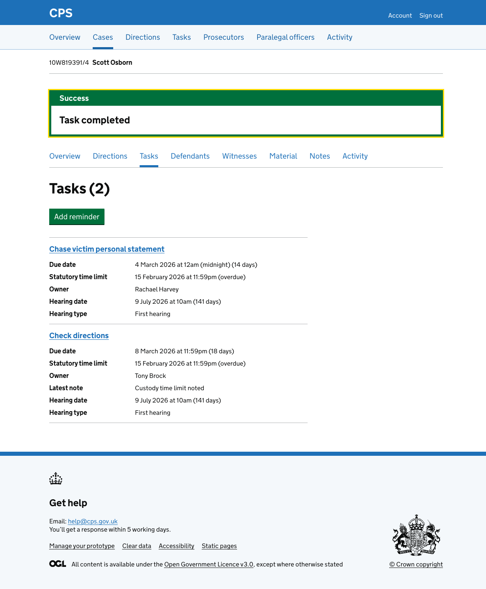

Users need to mark tasks as complete when the work is done. The complete task flow gives users a way to confirm they want to complete a task before doing so.

Users reach the flow by clicking "Complete task" on the [task details page](2026-02-18-case-task-show.md).

## How it works

The confirmation page shows the task name in an inset and asks users to confirm they want to complete it. A Cancel link lets users go back to the task details page without making any changes.

After confirming, the user is taken back to the [case task list](2026-02-18-case-task-list.md) where a success banner confirms "Task completed". The completed task no longer appears in the list.

