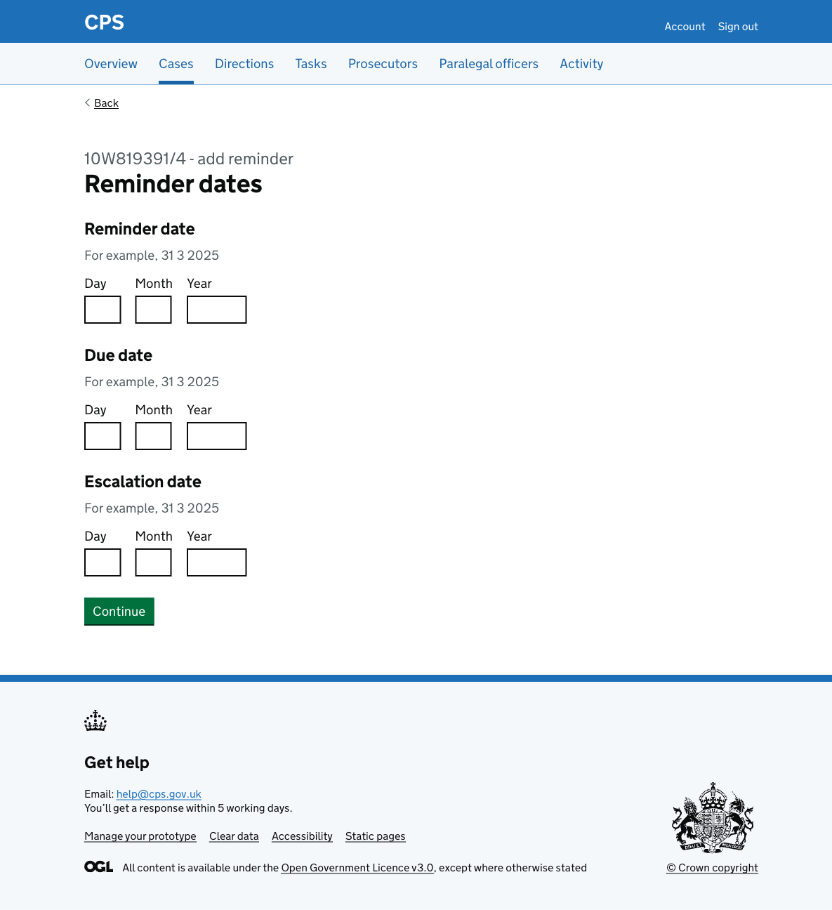
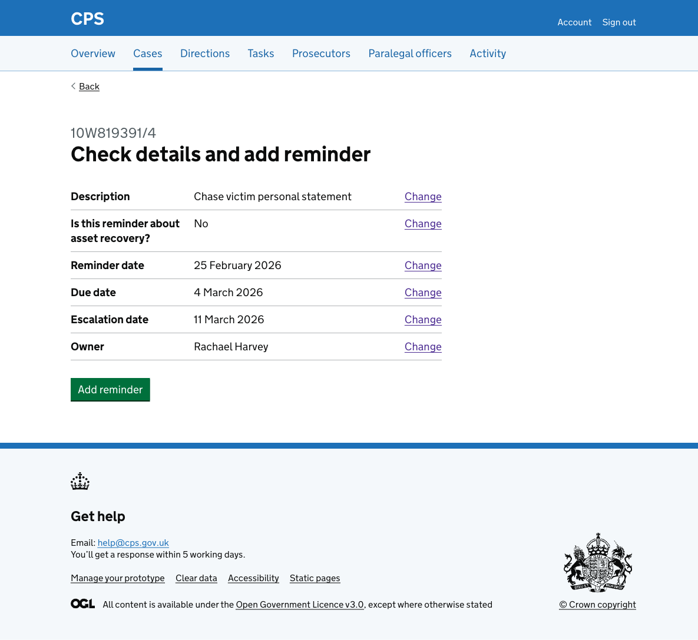
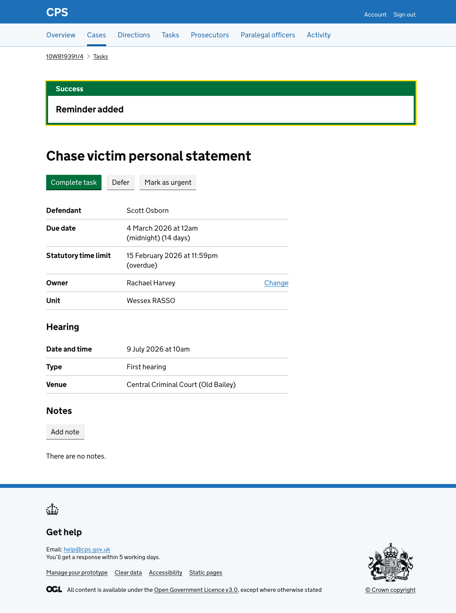

Users sometimes need to create their own reminders to follow up on something related to a case - for example, chasing a witness statement or checking on a document request. The add reminder flow lets users create a reminder task directly from the case task list.

Users reach the flow by clicking "Add reminder" on the [case task list](2026-02-18-case-task-list.md).

## How it works

The flow has 5 steps:

1. Description
2. Asset recovery
3. Reminder dates
4. Owner
5. Check answers

### Description

The user enters a free-text description of the reminder using a character count component with a 5,000 character limit.

### Asset recovery

The user answers whether this reminder is about asset recovery. This determines the reminder type stored against the task.

### Reminder dates

The user enters three dates:

- **Reminder date** - when the user should first be reminded
- **Due date** - when the task must be completed by
- **Escalation date** - when the task should escalate if still incomplete

### Owner

The user selects who the reminder is assigned to. The list includes all users in the case's unit, with the signed-in user shown first as "(you)". Admin pool and other team options for the unit appear at the bottom of the list.

### Check answers

The user reviews all their answers before confirming. Each row has a Change link to go back and edit that step.

### Confirmation

After submitting, the user is taken to the new task's detail page. A success banner confirms "Reminder added".

