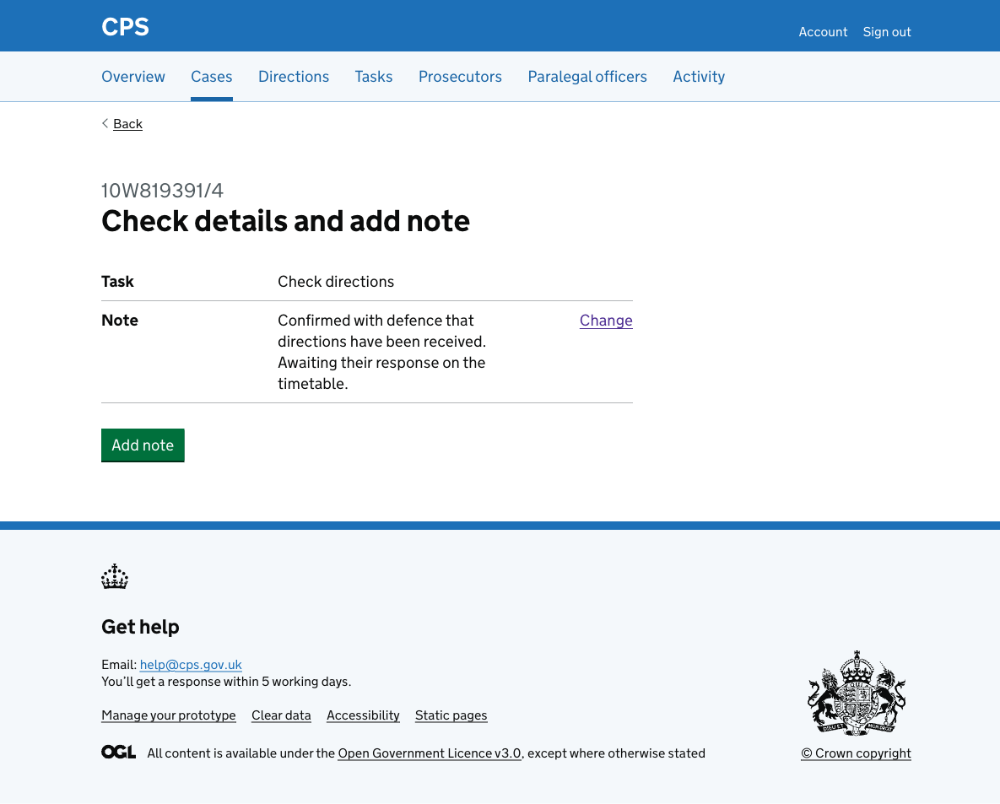
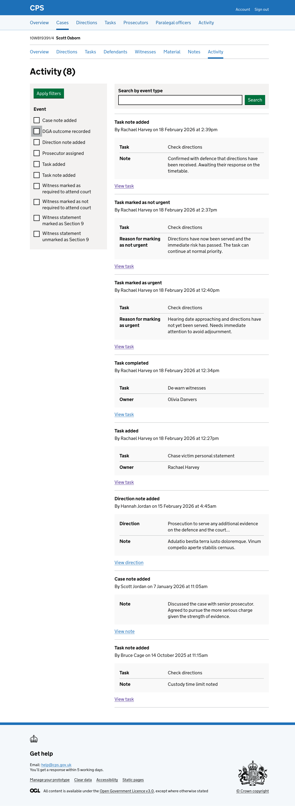

Users can add notes to tasks to record relevant information or actions taken. The add task note flow lets users write a note and confirm it before saving.

Users reach the flow by clicking "Add note" on the [task details page](2026-02-18-case-task-show.md).

## How it works

The flow has 2 steps:

1. Note
2. Check answers

### Note

The user enters a free-text note using a textarea. An inset shows the task name so users can confirm they are acting on the right task.

### Check answers

The user reviews their note before confirming. The task name is shown without a Change link. The note has a Change link to go back and edit it.

### Confirmation

After confirming, the user is taken back to the task details page. A success banner confirms "Note added". The new note appears at the top of the notes list.

### Activity log

The action is recorded in the case activity log as "Task note added", showing the task name and the note text.

## Error messages

### Note

| Scenario | Error message |
|---|---|
| No note entered | Enter a note |
