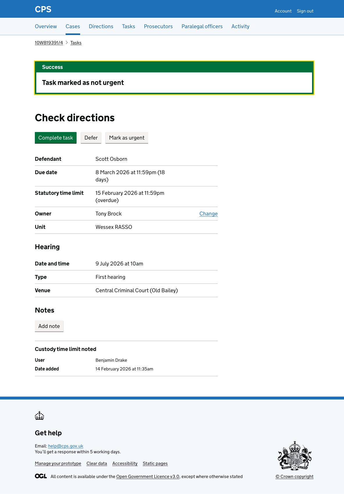

Tasks that have been marked as urgent can be marked as not urgent. 

Users reach the flow by . The button only appears when a task is already marked as urgent.

## How it works

Clicking "Mark as not urgent" on the [task details page](2026-02-18-adding-a-task-details-page.md) takes the user to enter a reason for marking the task as not urgent.

It uses a character count component with a 5,000 character limit. An inset shows the task name so users can confirm they are acting on the right task.

The user checks their answers before confirming. 

The reason has a change link to go back and change it.

After confirming, the user is taken back to the task details page. 

A success banner confirms "Task marked as not urgent". The Urgent tag is removed from the task heading and the "Mark as not urgent" button is replaced with "Mark as urgent".

### Activity log

The action is recorded in the case activity log as "Task marked as not urgent", showing the task name and the reason.

## Error messages

### Reason for marking as not urgent

| Scenario | Error message |
|---|---|
| No reason entered | Enter a reason for marking as not urgent |
| Reason is too long | Reason for marking as not urgent must be 5,000 characters or fewer |
