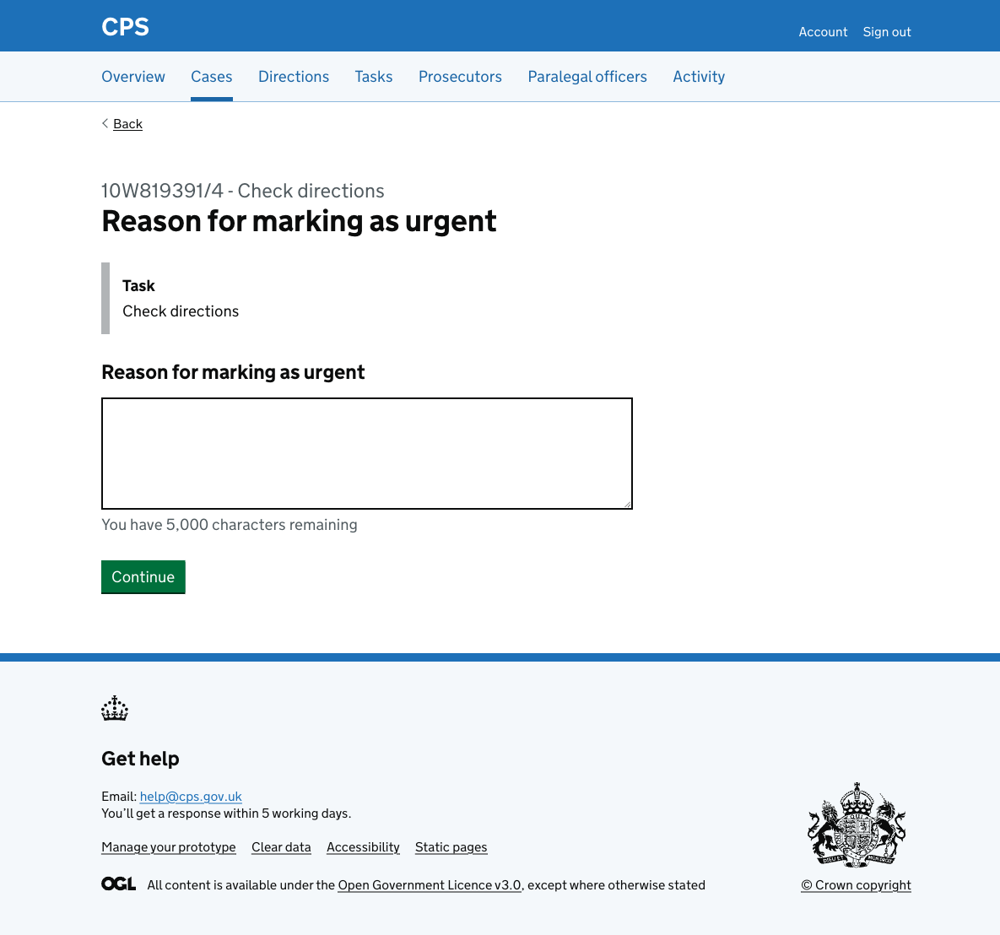
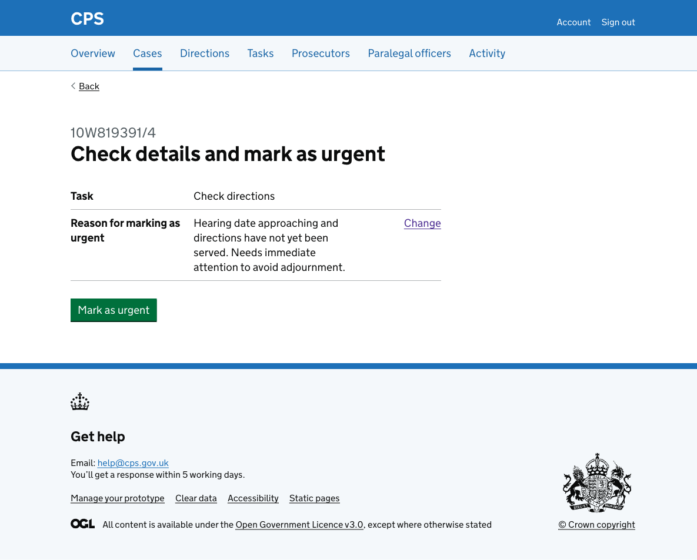

Tasks can be marked as urgent when they need immediate attention.

Users reach the flow by clicking "Mark as urgent" on the [task details page](2026-02-18-adding-a-task-details-page.md).

## How it works

Clicking “Mark as urgent” takes users to enter a free-text reason for marking the task as urgent using a character count component with a 5,000 character limit. 

An inset shows the task name so users can confirm they are acting on the right task.

The user can check their answers before confirming. 

The reason has a ‘Change’ link to allow users to go back and edit it.

After confirming, the user is taken back to the task details page. 

A success banner confirms "Task marked as urgent". The task heading now shows an "Urgent" tag, and the urgent reason appears in the task details.

### Activity log

The action is recorded in the case activity log as "Task marked as urgent", showing the task name and the reason.

## Error messages

### Reason for marking as urgent

| Scenario | Error message |
|---|---|
| No reason entered | Enter a reason for marking as urgent |
| Reason is too long | Reason for marking as urgent must be 5,000 characters or fewer |
