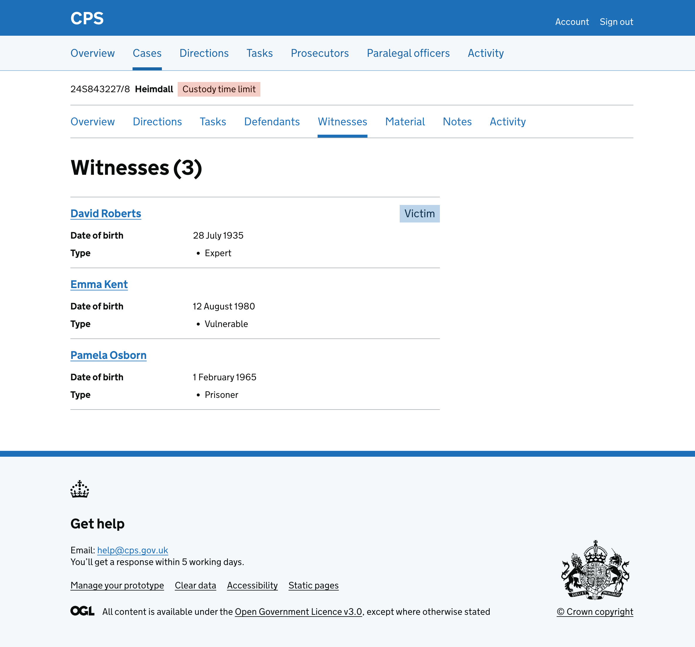
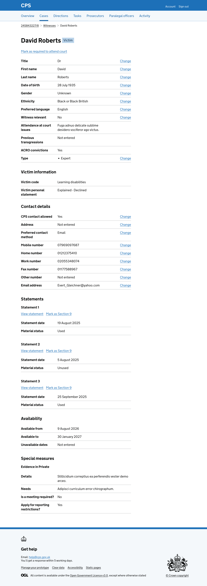
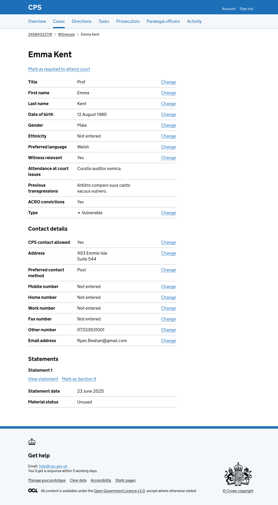

At the moment, the witness list shows all witness information on a single page using summary cards with tabs inside. 

Each witness has their own card containing tabs for:

- Statements
- Details
- Availability
- Special measures

But this has some usability downsides like:

- it puts a lot of information on one page, creating unnecessary cognitive load
- success messages need to mention the specific witness that has been updated
- users then have to scroll down to find the witness that has been updated
- the full-width layout means it’s harder to scan
- summary cards with tabs do not follow GOV.UK Design System patterns

So we removed the tabs and summary cards from the witness list and moved the information to a separate detail page means users only see the full details for the witness they are interested in, rather than having it all available but hidden behind tabs.

## What we changed

### Simplifying the witness list

We replaced the summary cards and tabs layout with a simple list of witnesses. 

Each witness is shown as a link with their name, date of birth, type and tags. Just enough for users to find the witness they’re looking for.

The list uses a two-thirds width column instead of full width, making it easier to scan.

### Adding a separate witness details page

Instead of showing everything in tabs on the list page, we moved all witness details to a separate page. 

Users click a witness name in the list to view their full details.

The witness details page uses breadcrumbs to let users navigate back to the witness list and the case.

### Reducing the number of tags shown for each witness

The previous design showed a tag for every witness type: 

- Victim
- Key witness
- Child
- Expert
- Interpreter
- Police
- Professional
- Prisoner
- Vulnerable
- Intimidated
- Court attendance status

This meant some witnesses had many tags, making it hard to spot the most important information.

We reduced the tags to only show:

- Victim (if the witness is a victim)
- Key witness (if the witness is a key witness)
- Required to attend court (if the witness has been marked as required to attend court)
- Not required to attend court (if the witness has been marked as not required to attend court)
- Section 9 (if the witness has at least one statement marked as Section 9)

We moved the other witness types into the summary list as a "Type" row on both the witness list and the witness details page. This keeps the type information available without cluttering the tags.

### Showing different sections depending on the witness

The witness details page shows different sections depending on the witness data.

All witnesses see:

- personal details (title, name, date of birth, gender, ethnicity, preferred language, witness relevance, attendance issues, previous transgressions, ACRO convictions and type)
- contact details (CPS contact allowed, address, preferred contact method, phone numbers and email)
- statements (with Section 9 status and material status)

Witnesses who are victims also see a "Victim information" section showing their victim code and victim personal statement.

Witnesses with Digital Case File (DCF) data also see:

- an "Availability" section showing when they are available for court
- a "Special measures" section showing any measures that have been requested

This means the page adapts to show only the information that is relevant to each witness, avoiding empty sections.

Witnesses without DCF data and who are not victims see a shorter page with just their personal details, contact details and statements.

