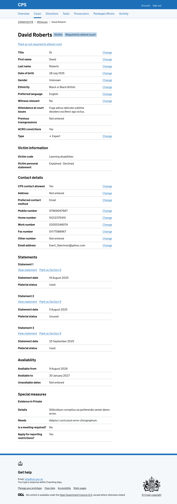
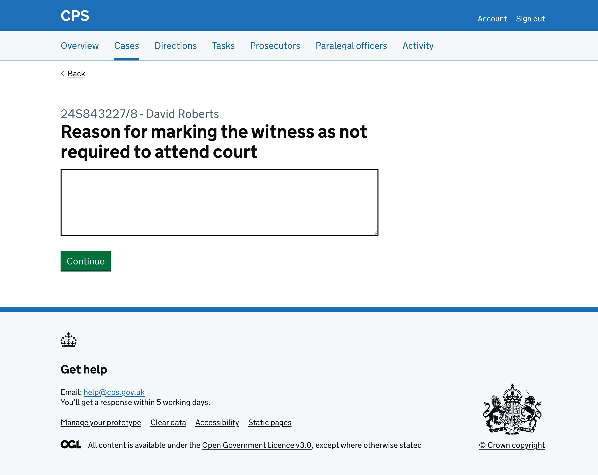
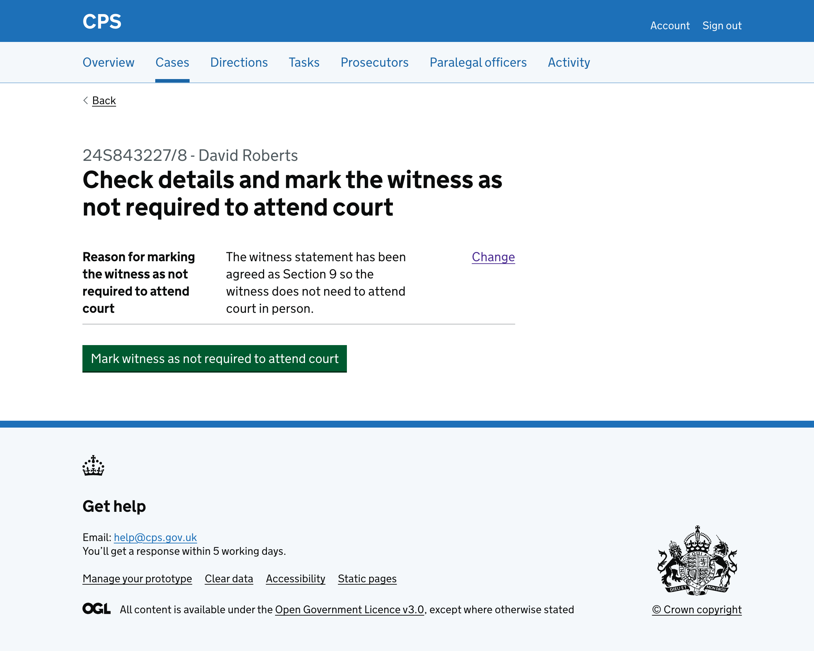
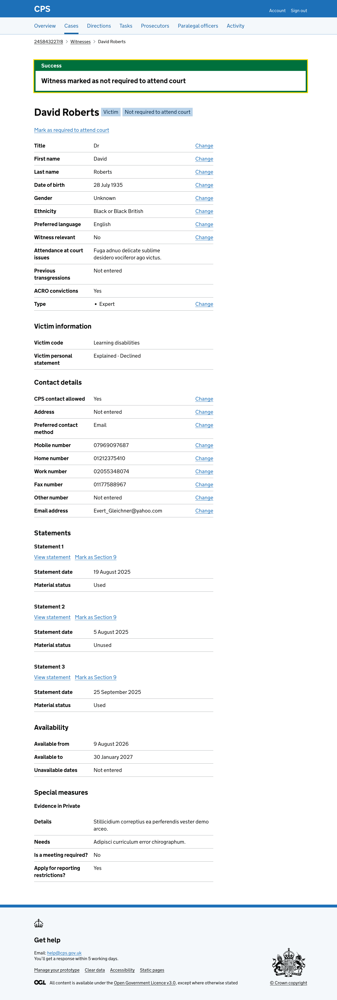
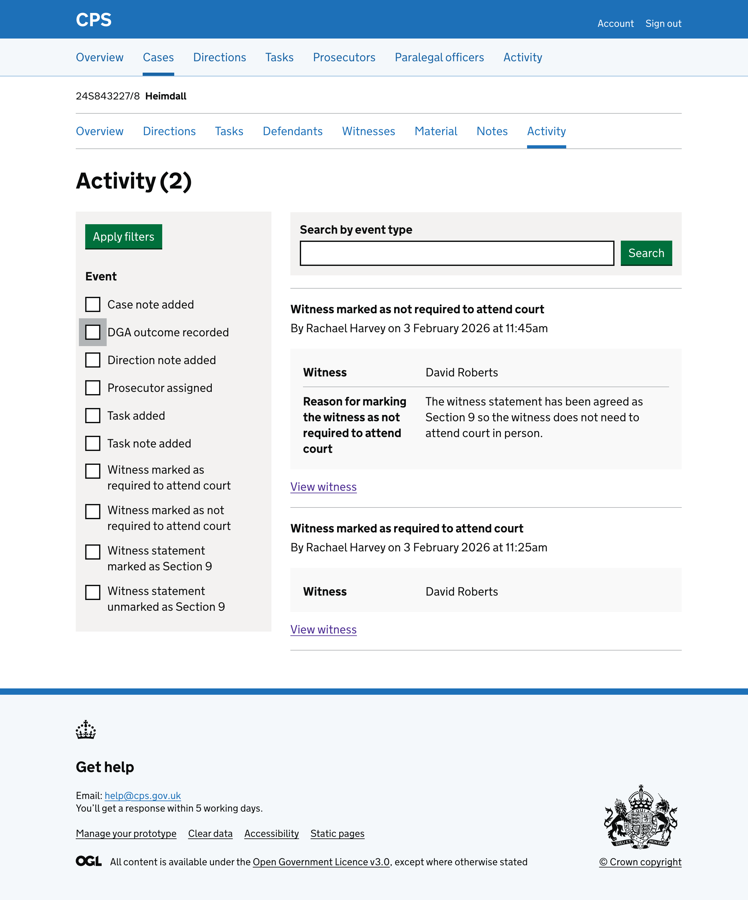

We recently added the ability to [mark a witness as required to attend court](/docs/design-history/2026-02-03-mark-witness-as-required-to-attend-court.md)

Users also need to be able to mark a witness as not required to attend court.

Users find this action on the witness details page.

## How it works

The witness details page shows a "Mark as not required to attend court" link at the top. This link is only shown when the witness has been marked as required to attend court.

Clicking the link takes the user to a page asking for a reason. 

The page shows a textarea with the label "Reason for marking the witness as not required to attend court". 

The case reference and witness name are shown as a caption above the heading.

After entering a reason and clicking "Continue", the user sees a check answers page. This shows the reason they entered in a summary list with a change link.

Clicking "Mark witness as not required to attend court" will:

- take the user back to the witness details page
- show a success banner at the top of the page saying "Witness marked as not required to attend court" - it will be focused and it will disappear when navigating away or refreshing the page
- show the "Not required to attend court" tag next to the witness name
- change the link to "Mark as required to attend court"

The action is recorded in the activity log. This will include the reason the user gave:

## Error messages

### Reason for marking the witness as not required to attend court

| Condition | Error message |
| --- | --- |
| Field is empty | Enter a reason for marking the witness as not required to attend court |

## Future considerations

This is not a complete journey. Marking a witness as not required to attend court also needs communications to be sent to the witness. That is currently a separate journey that users need to remember to do. We want to explore how to make this connection clearer so that users do not forget to send the communications.

We also want to test how users find marking multiple witnesses as not required to attend court. If users regularly need to mark several witnesses at once, we will consider adding bulk functionality to reduce the number of steps.
