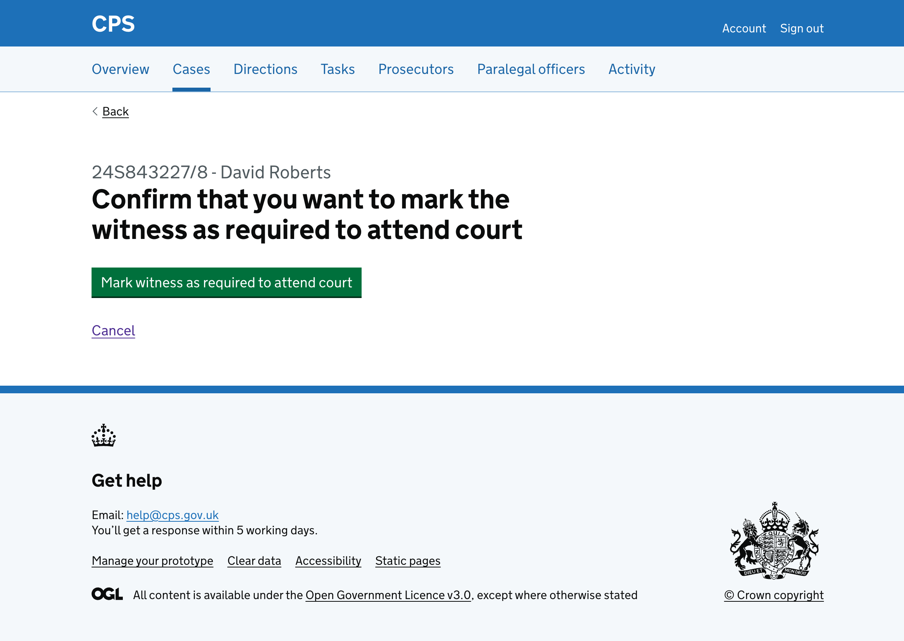
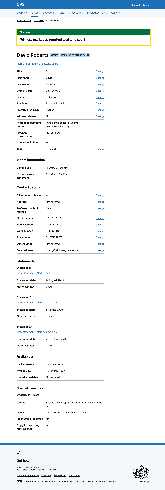
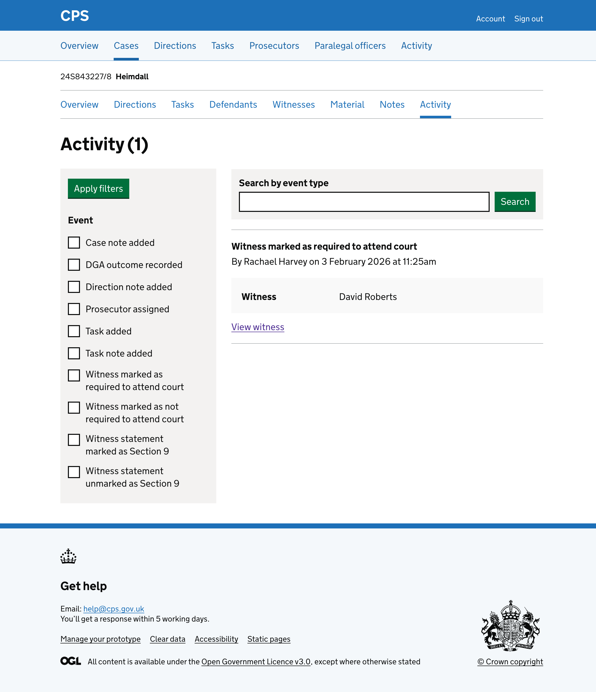

Users need to be able to mark a witness as required to attend court.

Users find this action on the witness details page.

## How it works

The witness details page shows a "Mark as required to attend court" link at the top.

This link is only shown when the witness has not been marked as required to attend court. If the witness has already been marked, the page shows a "Mark as not required to attend court" link instead.

Clicking the link takes the user to a page asking them to confirm they want to mark the witness as required to attend court.

The page shows the case reference and witness name as a caption above the heading, so users can check they are marking the right witness.

Clicking cancel will take the user back to the witness details page.

Clicking "Mark witness as required to attend court" will:

- takes the user back to the witness details page
- show a success banner at the top of the page saying "Witness marked as required to attend court" - it’ll disappear when navigating away or refreshing the page
- show the "Required to attend court" tag next to the witness name
- change the link to "Mark as not required to attend court"

The action is recorded in the activity log:

## Future considerations

This is not a complete journey. Requiring a witness to attend court also needs communications to be sent to the witness. That is currently a separate journey that users need to remember to do. We want to explore how to make this connection clearer so that users do not forget to send the communications.

We also want to test how users find marking multiple witnesses as required to attend court. If users regularly need to mark several witnesses at once, we will consider adding bulk functionality to reduce the number of steps.
