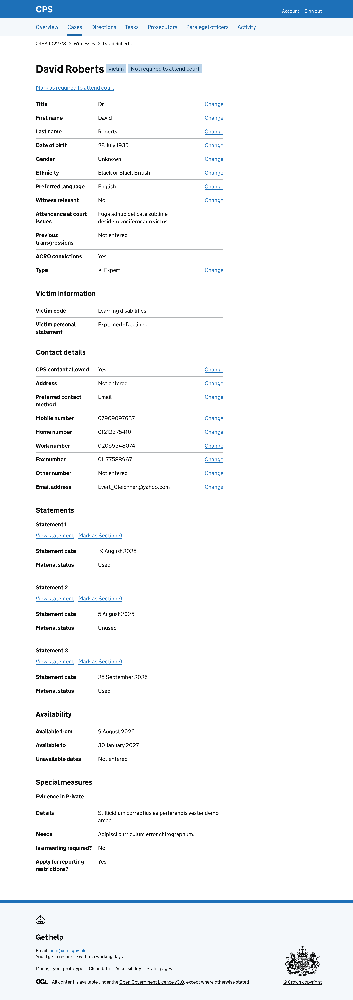
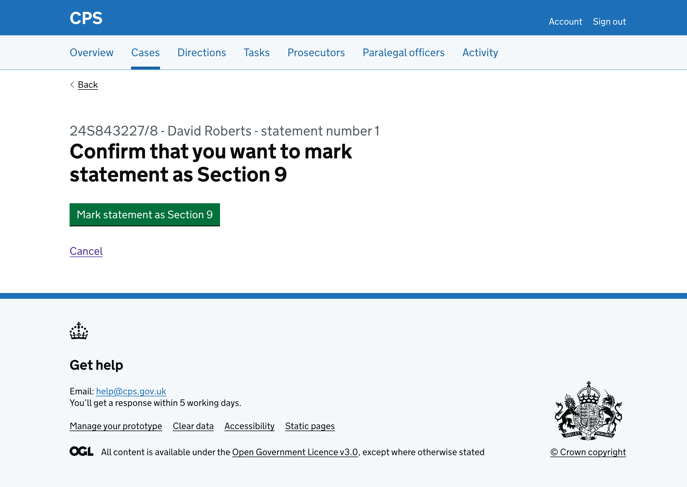
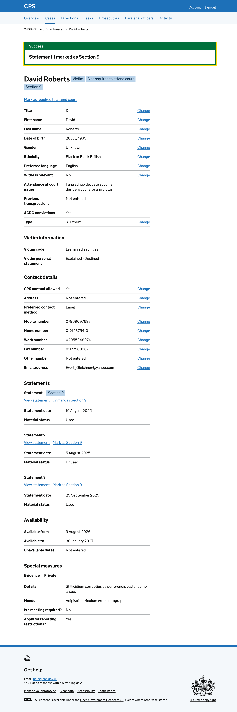
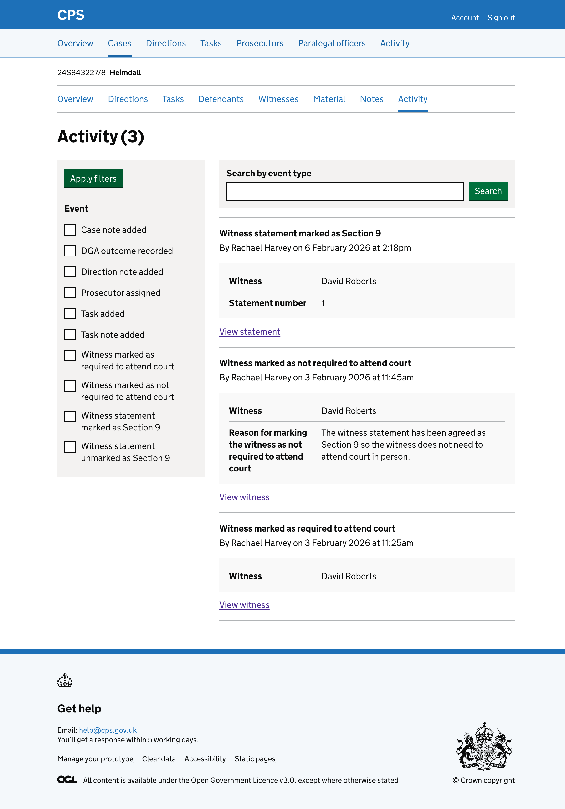

Under Section 9, a witness statement can be read in court instead of requiring the witness to give oral evidence. This is used for uncontroversial evidence where the defence does not need to cross-examine the witness.

Users need to be able to mark individual witness statements as Section 9 so that the case file accurately reflects which statements have been agreed for reading in court.

Users find this action on the witness details page, under each statement.

## How it works

Each statement on the witness details page shows a "Mark as Section 9" link.

Clicking the link takes the user to a confirmation page asking them to confirm they want to mark the statement as Section 9.

The page shows the case reference, witness name and statement number as a caption above the heading, so users can check they are marking the right statement.

Clicking cancel takes the user back to the witness details page.

Clicking "Mark statement as Section 9" will:

- take the user back to the witness details page
- show a success banner at the top of the page saying "Statement 1 marked as Section 9" - it will disappear when navigating away or refreshing the page
- show a "Section 9" tag next to the witness name
- show a "Section 9" tag next to the statement heading
- change the link from "Mark as Section 9" to "Unmark as Section 9"

The "Section 9" tag next to the witness name is shown when any of the witness's statements have been marked as Section 9.

The action is recorded in the activity log, showing the witness name and statement number:

## Future considerations

We want to test how users find marking multiple witness statements as Section 9. If users regularly need to mark several statements at once, we will consider adding bulk functionality to reduce the number of steps.
