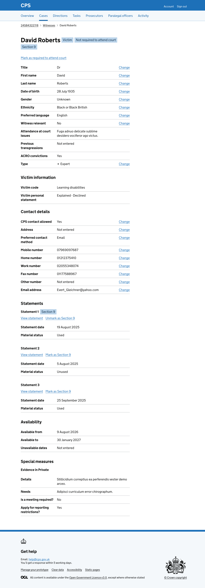
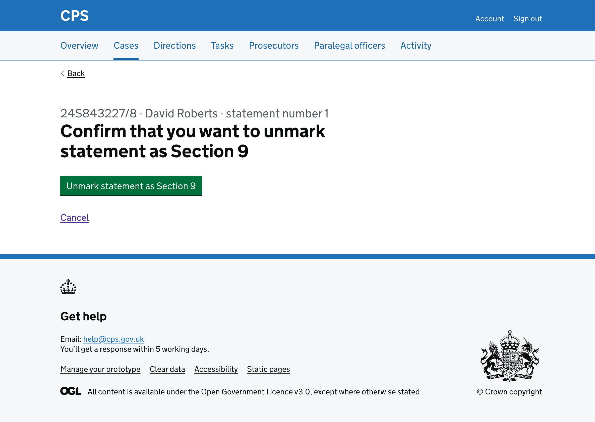
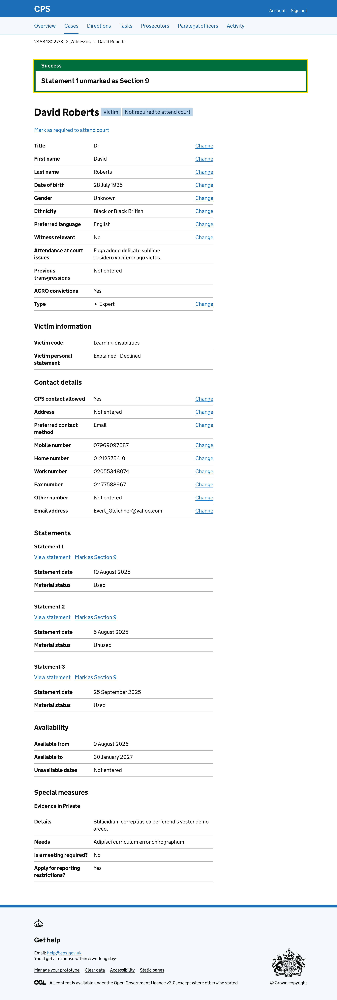
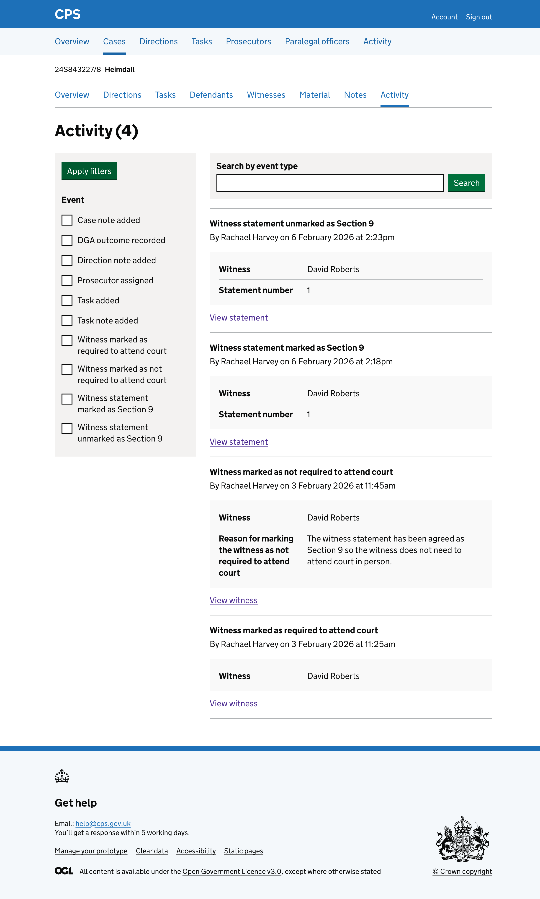

We recently added the ability to [mark a witness statement as Section 9](/docs/design-history/2026-02-06-mark-witness-statement-as-section9.md).

Users also need to be able to unmark a statement as Section 9 if circumstances change - for example, if the defence objects to the statement being read and the witness now needs to give oral evidence.

Users find this action on the witness details page, under each statement that has been marked as Section 9.

## How it works

When a statement has been marked as Section 9, it shows an "Unmark as Section 9" link.

Clicking the link takes the user to a confirmation page asking them to confirm they want to unmark the statement as Section 9.

The page shows the case reference, witness name and statement number as a caption above the heading, so users can check they are unmarking the right statement.

Clicking cancel takes the user back to the witness details page.

Clicking "Unmark statement as Section 9" will:

- take the user back to the witness details page
- show a success banner at the top of the page saying "Statement 1 unmarked as Section 9" - it will disappear when navigating away or refreshing the page
- remove the "Section 9" tag from next to the witness name (if no other statements are marked as Section 9)
- remove the "Section 9" tag from next to the statement heading
- change the link from "Unmark as Section 9" to "Mark as Section 9"

The action is recorded in the activity log, showing the witness name and statement number:

## Future considerations

We want to test how users find unmarking multiple witness statements as Section 9. If users regularly need to unmark several statements at once, we will consider adding bulk functionality to reduce the number of steps.
