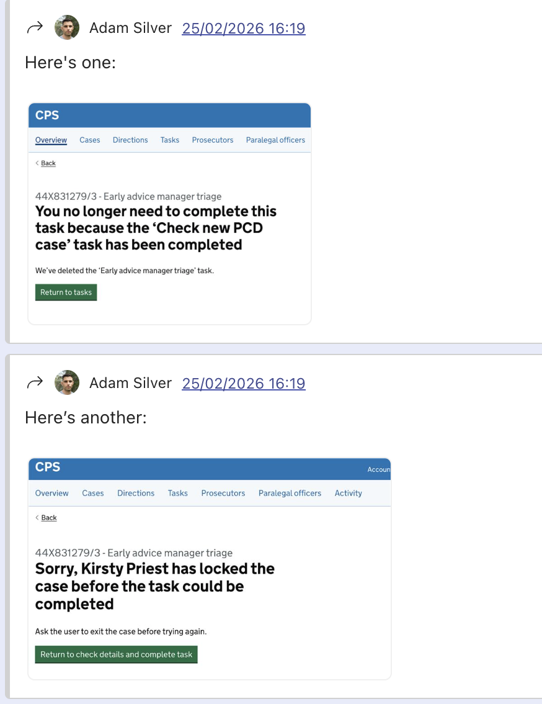

# Why we're doing this work

## The problem

A criminal case moves through three main phases: 

1. police send raw material (the case file)
2. CPS forms a prosecution case from that material
3. That prosecution case is tested in court

The gap between "case file received" and "prosecution case formed" is where most of the work happens — the case-building phase. 

This is where prosecutors make decisions, weigh evidence, and establish what the case actually is: what is alleged, what the evidence shows, what material is unused, what decisions have been made and why.

The current system stores documents and creates tasks. 

But it does not consistently capture what the case is, what decisions have been made, or why. The prosecution case has to be reconstructed from materials at each stage, by each person who picks it up.

Work is organised by tasks and their deadlines, not by what the case needs. Tasks closest to hearing dates are surfaced as urgent. Some users describe it like this:

"Everything is red. You're just working through what's on fire."

This shapes the whole process:

- Tasks closest to a hearing are completed first. 
- Earlier preparation is deprioritised. 
- A reviewing lawyer may have a case in their task list — a police-charged, not-guilty-anticipated case that needs review — but it won't get done because higher-priority tasks are ahead of it. 
- The system has no way of flagging to anyone downstream that the review has not been done, other than its absence.
 
The tasks themselves are fragmented rather than following a flow. A case may sit in the operational delivery task list to have bundles served, surfacing as priority by hearing date — but detached from whether the reviewing lawyer has actually completed their review first.

As a result, cases move forward while incomplete. Preparation that should happen early often gets carried into the hearing. Decisions that should be visible often aren't. The same information gets checked and assembled multiple times, by different people with partial views.

### What might have been lost

Paper bundles gave prosecutors something the current digital system has not consistently replicated. Key information was brought to the front. Material was ordered to reflect importance and narrative. Advocates had a record sheet. You could see what the case was, where it was up to, and what mattered. Users could rearrange material, annotate it, add tabs and stickies.

The digital case behaves more like a bundle of documents than a structured case record. There isn't an easy way to see what has happened. It's hard to see what is important. It's hard to work out what decisions have been made and why. The structure and ordering varies. The prosecution case is not explicitly defined — it has to be inferred from the material.

## Why building more features on the current system doesn't fix it

These aren't interface bugs. They're structural — built into how the system models work.

- The system has no concept of case state, only tasks. 
- It has no mechanism to stop a case progressing while incomplete. 
- It doesn't carry decisions forward between stages. 
- Evidence lives in separate places. 
- Work is split across roles with no one owning the whole case end-to-end.

We've been building new features on top of this. But each feature has to stay in sync with the legacy system, which means it has to work the same way. Users get a new interface with the same constrained workflows, plus the overhead of using two systems.

The following examples show how this plays out today.

### Example #1: Finding cases ready to assign after triage

A charging manager needs to find cases ready to assign after triage. 

The system can't simply show "cases ready to assign" because the current system doesn't have that concept — it can only be at best, inferred from task states.

One way a user could do that is by filtering the task list by specific task types (28 day PCD review, 5 day PCD review, Further PCD review), one unit and one task type at a time. 

This only works if they understand the internal mechanics: that these review tasks are created only after the initial triage tasks are completed. They also have to know which triage task types exist in the first place (Check new PCD case, Check resubmitted PCD case, Priority PCD review, Priority resubmitted PCD case).

One task type — Priority PCD review — is also dual-purpose. The casework assistant completes the triage part first, then the task stays open for the prosecutor. So users have to open individual tasks to check whether the triage part has actually been done, even after filtering.

### Example #2: Finding cases sent from magistrates to crown court

A paralegal business manager at a crown court needs to find cases that have had their first hearing in magistrates and been sent to crown court for trial. 

Every case, even murder, must have a first hearing in magistrates court first.

Two workarounds exist:

Workaround 1: filter the task list by "Post Sending Review", also filtering by unit, then scan results for tasks where the owner is the crown court team. This only works if you know that completing a "Record hearing outcome" task triggers a "Post Sending Review" task — which in turn only gets created after someone sets the next hearing type and changes the venue to a crown court.

Workaround 2: filter the case list by hearing type (PTPH or other relevant types), court, and live cases, then sort by prosecutor to group crown court team cases together. The hearing type filter matches on any hearing associated with the case — past or future — but results only show the next upcoming hearing, which is not obvious and makes the filter harder to reason about.

Both workarounds require understanding the chain of internal events. Neither shows you what you're actually looking for.

### Example #3: Allocating a case immediately after triage

In some areas, casework assistants allocate a case straight after completing the triage flow. 

Completing triage currently returns the user to the task list with no easy path back to the case they just triaged, and no mechanism connecting it to the next logical action. 

If the user doesn't allocate immediately, there's no easy way to find that case again.

### Example #4: Error messages as symptoms

The two screenshots below were created recently for the current system. 

Both are written as clearly as possible given the situation. But the situation itself shouldn't exist.

In the first, a user is told they no longer need to complete a task because someone else has already done it. The system doesn't prevent two people attempting the same task, so this has to be caught and communicated after the fact.

In the second, a user is told a case has been locked by another user before they could complete their task — a consequence of how the legacy system manages concurrent access.

These are symptoms of a system that doesn't model the work — not content problems to be written around.

## What we'd like to do instead

We'd like to design an end-to-end journey for one case type.

Perhaps that case type could be: shoplifting, magistrates court, one offence — unconstrained by the legacy system.

We think shoplifting is high volume and low complexity, which might make it a good starting point. It also has a real and significant problem: cases can reach court without the evidence in place. That gives us something concrete to test — whether a better-designed process can make a genuine difference.

Instead of building individual features across the whole system (vertical slicing), we're building a complete journey for this one slice (horizontal slicing, also known as the strangler fig approach). 

Users in that slice complete their entire job in the new system. No switching.

Technically this means:

- One-way sync only: the legacy system feeds new cases in, no write-back
- A database designed around user needs, not legacy constraints
- Case state modelled directly, not inferred from combinations of task types

## What this makes possible

When the case-building phase is properly supported:

- The prosecution case is explicitly formed — you can see what it is, what's been decided, and why
- Work is organised around case readiness, not just upcoming deadlines
- Decisions persist and carry forward — the case doesn't have to be reconstructed at every stage
- Everyone involved shares a coherent view of the same case

The orientation, narrative, and chronology that paper bundles once provided becomes something the system actively supports — and can go further, because it's not limited to what fits in a folder.

## Why now

Architecture decisions are being made. Without a clear, user-centred vision, those decisions risk encoding the same structural constraints into the new system. This work gives the architecture a foundation grounded in what users actually need, not in what the legacy system currently does.

The shoplifting slice is the start. Once it works, the foundation carries forward. Scaling to the next case type is significantly easier than starting from scratch. The first slice is the hard part.
